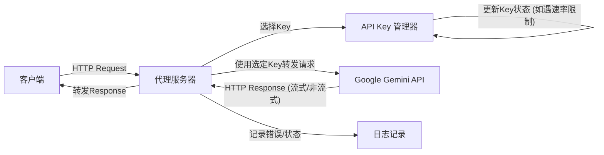

# Gemini API 聚合代理服务 - 详细设计文档

## 1. 引言与背景

**根本问题：** 在 Cline 插件等客户端中直接使用单个 Google Gemini API Key 时，由于 Google API 的并发限制（`API reach limit`），无法满足高并发或频繁使用的需求，导致服务不稳定或不可用。

**目标：** 开发一个本地代理服务（Gemini Aggregator），通过管理和调度多个 Google Gemini API Key，有效规避单一 Key 的并发限制，提高 Gemini API 的整体可用性和并发处理能力，并确保流式响应能够实时转发给客户端。

## 2. 系统目标

*   **提高并发性：** 允许多个客户端请求同时通过代理服务访问 Gemini API。
*   **提高可用性：** 当某个 API Key 达到速率限制时，自动切换到其他可用 Key，减少服务中断。
*   **透明代理：** 对客户端尽可能透明，客户端只需将请求目标指向代理服务即可，无需关心底层 Key 的切换逻辑。
*   **流式响应支持：** 必须支持将 Google API 的流式响应（Server-Sent Events）实时、低延迟地转发给客户端，实现“打字机”效果。
*   **易于管理：** 提供简单的方式来配置和管理 API Key 池。
*   **健壮性：** 能够妥善处理 Google API 的各种错误，特别是速率限制错误。

## 3. 系统架构

本系统采用经典的代理服务器架构模式。



**核心组件:**

1.  **HTTP 代理服务器 (Express.js):** 接收客户端请求，作为系统的入口和出口。负责解析请求，调用其他模块，并将最终响应（或错误）返回给客户端。
2.  **API Key 管理器:** 维护 API Key 池，管理每个 Key 的状态（可用、冷却中、请求计数等），并提供加载和获取可用 Key 的接口。
3.  **请求分发器:** 根据预定策略（如轮询、最少使用等），从 API Key 管理器中选择一个合适的 Key 来处理当前请求。
4.  **Google API 转发器:** 使用选定的 Key，构造并发送请求到真实的 Google Gemini API Endpoint。处理 Google API 的响应，特别是区分流式和非流式响应。
5.  **流式响应处理器:** 专门处理 Google API 的流式响应，确保数据块被实时转发给客户端。
6.  **错误处理器:** 统一处理系统内部错误和来自 Google API 的错误，特别是速率限制错误，并触发 Key 管理器更新 Key 状态。
7.  **配置模块:** 加载和管理系统配置，如监听端口、API Key 列表等。
8.  **日志模块:** 记录关键事件、请求处理过程和错误信息，便于监控和调试。

## 4. 模块详细设计

### 4.1. HTTP 代理服务器 (`src/server.ts`, `src/routes/proxy.ts`)

*   **职责:**
    *   使用 Express.js 创建和配置 HTTP 服务器。
    *   监听指定端口（例如 `3000`）。
    *   定义一个或多个路由（例如 `/v1beta/models/:model:generateContent`）来接收客户端的 Gemini API 请求。
    *   解析客户端请求（方法、路径、头部、请求体）。
    *   调用请求分发器获取 API Key。
    *   调用 Google API 转发器处理请求。
    *   处理来自转发器的响应，并将其发送回客户端（特别注意流式响应的处理）。
    *   集成错误处理中间件。
    *   集成日志中间件。
*   **接口:**
    *   `POST /v1beta/models/:model:generateContent` (或其他 Gemini API 支持的路径)
*   **关键逻辑:**
    *   保留大部分客户端请求头，但可能需要移除或修改 `Host`、`Content-Length` 等头。
    *   正确设置响应头以支持流式传输 (`Transfer-Encoding: chunked`, `Content-Type: text/event-stream` 或 Google API 返回的类型)。

### 4.2. API Key 管理器 (`src/core/ApiKeyManager.ts`)

*   **职责:**
    *   从配置（环境变量或文件）中加载 Gemini API Key 列表。
    *   维护 Key 池，存储每个 Key 及其状态。
    *   提供获取可用 Key 的方法。
    *   提供更新 Key 状态的方法（例如，标记为冷却中、增加/减少并发计数）。
    *   实现 Key 的冷却机制（收到速率限制错误后，在一段时间内不使用该 Key）。
*   **数据结构 (`src/types/ApiKey.ts`):**
    ```typescript
    interface ApiKey {
      key: string; // API Key 值
      status: 'available' | 'cooling_down' | 'disabled'; // 当前状态
      coolingDownUntil?: number; // 冷却结束时间戳 (ms)
      currentRequests: number; // 当前使用此 Key 处理的并发请求数 (可选，用于更复杂的策略)
      // 可以添加其他统计信息，如总请求数、失败次数等
    }
    ```
*   **接口:**
    *   `loadKeys(): void`
    *   `getAvailableKey(): ApiKey | null`
    *   `markAsCoolingDown(key: string, durationMs: number): void`
    *   `markAsAvailable(key: string): void`
    *   `incrementRequestCount(key: string): void` (可选)
    *   `decrementRequestCount(key: string): void` (可选)
*   **关键逻辑:**
    *   需要考虑并发访问 Key 池时的线程安全问题（虽然 Node.js 是单线程，但异步操作可能导致状态不一致，可以使用简单的锁或队列机制）。
    *   定期检查冷却中的 Key 是否可以恢复使用。

### 4.3. 请求分发器 (`src/core/RequestDispatcher.ts`)

*   **职责:**
    *   实现选择可用 API Key 的策略。
    *   与 API Key 管理器交互以获取 Key。
*   **策略:**
    *   **简单轮询 (Round Robin):** 按顺序依次选择可用的 Key。
*   **接口:**
    *   `selectApiKey(): Promise<ApiKey | null>` (返回 Promise 以处理异步获取)
*   **关键逻辑:**
    *   处理没有可用 Key 的情况（例如，所有 Key 都在冷却中），可以返回特定错误或等待。

### 4.4. Google API 转发器 (`src/core/GoogleApiForwarder.ts`)

*   **职责:**
    *   接收来自代理服务器的客户端请求信息和选定的 API Key。
    *   构造发送给 Google Gemini API 的 HTTP 请求。
    *   使用 `@google/generative-ai` SDK 或 Node.js 内置的 `https` 模块发送请求。
    *   处理 Google API 的响应，区分流式和非流式。
    *   将响应（或错误）传递回代理服务器。
*   **接口:**
    *   `forwardRequest(clientRequest: Request, apiKey: ApiKey): Promise<{ response: Response | Stream, error?: Error }>`
*   **关键逻辑:**
    *   正确设置 Google API 请求的认证信息（通常是 `x-goog-api-key` 头）。
    *   复制必要的客户端请求头和请求体。
    *   **流式处理:** 如果请求参数指定了流式 (`stream=true`)，需要使用 Google SDK 的 `generateContentStream` 方法或直接处理 HTTP 响应流。**不缓冲整个响应**，而是逐块读取并传递。
    *   **非流式处理:** 等待 Google API 返回完整响应。
    *   **错误识别:** 解析 Google API 返回的错误，特别是识别速率限制错误 (HTTP 429 Too Many Requests 或特定错误代码)。

### 4.5. 流式响应处理器 (`src/core/StreamHandler.ts` 或集成在 `GoogleApiForwarder.ts` / `proxy.ts` 中)

*   **职责:**
    *   专门处理从 Google API 收到的流式数据块 (Server-Sent Events)。
    *   将每个数据块实时写入到给客户端的 HTTP 响应流中。
    *   确保客户端能够正确接收和解析流式数据。
*   **关键逻辑:**
    *   监听 Google API 响应流的 `data` 事件。
    *   获取数据块 (`chunk`)。
    *   直接调用 Express `response.write(chunk)` 将数据块写入客户端响应流。
    *   监听 Google API 响应流的 `end` 事件，调用 `response.end()` 结束客户端响应流。
    *   监听 Google API 响应流的 `error` 事件，进行错误处理并可能需要中断客户端响应。

### 4.6. 错误处理器 (`src/middlewares/errorHandler.ts`)

*   **职责:**
    *   捕获系统中的同步和异步错误。
    *   区分不同类型的错误（如配置错误、网络错误、Google API 错误、无可用 Key 错误等）。
    *   **处理速率限制 (429):**
        *   识别出是哪个 Key 触发了限制。
        *   调用 `ApiKeyManager.markAsCoolingDown()` 将该 Key 标记为冷却。
        *   可以选择重试请求（使用不同的 Key）或将错误返回给客户端。
    *   记录详细的错误日志。
    *   向客户端返回标准格式的错误响应。
*   **关键逻辑:**
    *   Express 的错误处理中间件通常有 4 个参数 `(err, req, res, next)`。
    *   根据错误类型和状态码决定响应内容和状态码。

### 4.7. 配置模块 (`src/config/index.ts`)

*   **职责:**
    *   加载环境变量 (`.env` 文件) 或配置文件。
    *   提供类型安全的配置访问接口。
*   **配置项:**
    *   `PORT`: 服务器监听端口。
    *   `GEMINI_API_KEYS`: 逗号分隔的 API Key 字符串。
    *   `KEY_COOL_DOWN_DURATION_MS`: Key 冷却时间（毫秒）。
    *   `LOG_LEVEL`: 日志级别。
    *   (可选) `DISPATCH_STRATEGY`: 请求分发策略 ('round_robin', 'least_connections')。

### 4.8. 日志模块 (`src
*   **职责:**
    *   提供不同级别的日志记录功能（debug, info, warn, error）。
    *   记录请求入口、Key 选择、转发过程、响应状态、错误信息等。
*   **关键逻辑:**/middlewares/logger.ts` 或使用 `pino`, `winston` 等库)

    *   可以使用成熟的日志库简化实现。
    *   日志格式应包含时间戳、请求 ID（可选）、日志级别和消息。

## 5. 数据结构

*   **ApiKey:** 见 4.2 节。
*   **Configuration:** 包含所有配置项的类型定义。

## 6. 错误处理策略

*   **客户端请求错误 (4xx):** 如无效的请求体、路径错误等，直接将错误信息转发给客户端。
*   **代理内部错误 (5xx):** 如配置加载失败、无法连接 Key 管理器等，记录详细错误日志，向客户端返回通用 500 错误。
*   **无可用 API Key:**
    *   策略一：立即返回 503 Service Unavailable 错误给客户端。
    *   策略二：等待一小段时间后重试获取 Key（可能增加延迟）。
*   **Google API 错误:**
    *   **速率限制 (429):**
        1.  识别触发限制的 Key。
        2.  调用 `ApiKeyManager.markAsCoolingDown()`。
        3.  记录日志。
        4.  **可选重试:** 尝试使用 `RequestDispatcher.selectApiKey()` 获取另一个 Key 并重新调用 `GoogleApiForwarder.forwardRequest()`。设置最大重试次数。
        5.  如果重试失败或不重试，将 429 错误（或映射为 503）返回给客户端。
    *   **认证错误 (401/403):** 可能 Key 无效或权限不足。标记 Key 为 `disabled`，记录错误，返回 500 或相应的错误码给客户端。
    *   **其他 Google API 错误 (4xx/5xx):** 记录错误，并将 Google 返回的错误状态码和信息尽可能透传给客户端。

## 7. 项目目录结构

```
gemini-aggregator/
├── dist/                     # 编译后的 JavaScript 文件
├── node_modules/             # 项目依赖
├── src/                      # 源代码目录
│   ├── server.ts             # Express 服务器入口与配置
│   ├── config/               # 配置加载与管理
│   │   ├── index.ts
│   │   └── keys.ts           # (或通过 .env 加载)
│   ├── core/                 # 核心业务逻辑
│   │   ├── ApiKeyManager.ts  # API Key 管理
│   │   ├── RequestDispatcher.ts# 请求分发策略
│   │   ├── GoogleApiForwarder.ts# Google API 请求转发
│   │   └── StreamHandler.ts    # (或集成在 Forwarder/proxy 中) 流式处理逻辑
│   ├── routes/               # Express 路由定义
│   │   └── proxy.ts          # 代理 API 路由
│   ├── middlewares/          # Express 中间件
│   │   ├── errorHandler.ts   # 统一错误处理
│   │   └── logger.ts         # 请求日志
│   └── types/                # TypeScript 类型定义
│       ├── index.ts
│       └── ApiKey.ts         # Key 状态等类型
├── .env.example              # 环境变量示例文件
├── .gitignore                # Git 忽略配置
├── package.json              # 项目元数据与依赖
├── tsconfig.json             # TypeScript 编译配置
├── README.md                 # 项目说明 (原始文件)
└── DESIGN.md                 # 详细设计文档 (本文档)
```

## 8. 技术选型

*   **语言:** TypeScript
*   **框架:** Express.js
*   **HTTP 客户端:** `@google/generative-ai` SDK (优先) 或 Node.js `https` 模块
*   **配置管理:** `dotenv`
*   **日志:** `pino` 或 `winston` (推荐)
*   **包管理器:** `npm` 或 `yarn`

## 9. 部署考虑 (可选)

*   可以使用 Docker 将应用容器化。
*   考虑使用 PM2 或类似工具来管理 Node.js 进程，实现后台运行和自动重启。
*   API Key 应通过环境变量注入，而不是硬编码在代码或配置文件中。
*   需要监控服务的资源使用情况（CPU、内存）和 API Key 的状态。