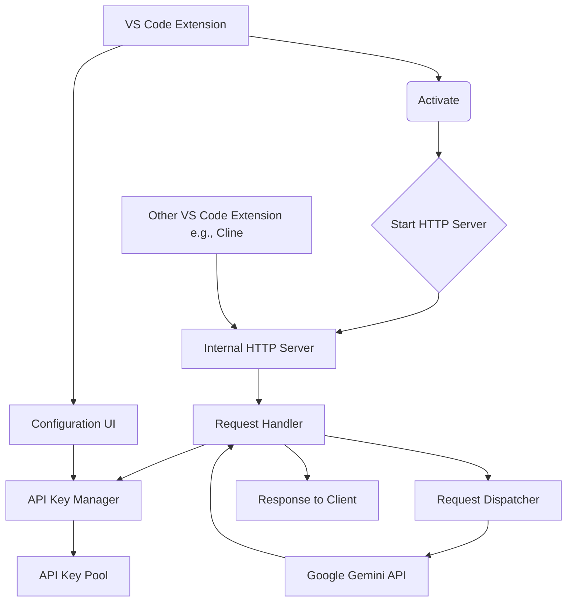

# 将本地代理服务器集成到 VS Code 插件的计划

根据需求，我们将把现有的 Google Gemini API Key 本地代理服务器集成到一个 VS Code 插件中，以解决并发限制并支持流式响应。

**关键考虑因素：**

1.  **VS Code 插件结构：** 如何在插件的生命周期中启动和管理一个 HTTP 服务器。
2.  **依赖管理：** 如何在插件环境中处理项目现有的依赖（如 Express.js）。
3.  **API Key 管理界面：** 如何在 VS Code 中提供一个用户界面来配置和管理 API Key。
4.  **与现有扩展的交互：** 如何让其他扩展（如 Cline）能够发现并使用这个内嵌的代理服务。
5.  **错误处理和日志记录：** 如何在插件环境中有效地处理错误和记录日志。

**详细计划步骤：**

1.  **分析现有项目结构：** 深入了解当前代理服务器的代码结构，特别是服务器启动、请求处理、API Key 管理和请求分发的核心模块。
2.  **创建 VS Code 插件项目：** 使用 VS Code 提供的 Yeoman 生成器创建一个新的 TypeScript 插件项目。
3.  **集成代理服务器代码：** 将现有代理服务器的核心逻辑代码迁移到插件项目中。这可能需要对代码进行一些调整，以适应 VS Code 插件的运行环境。
4.  **在插件中启动 HTTP 服务器：** 在插件的 `activate` 方法中启动内嵌的 HTTP 服务器。需要选择一个合适的端口，并考虑端口冲突的问题。
5.  **实现 API Key 管理界面：** 利用 VS Code 的 `Configuration` API 或 `Webview` API 创建一个界面，允许用户在 VS Code 设置中配置和管理 API Key。
6.  **提供代理服务地址：** 插件需要向其他扩展暴露内嵌代理服务器的地址和端口。这可以通过 VS Code 的 `Extension API` 或其他机制实现。
7.  **处理插件生命周期：** 确保在插件激活时启动服务器，在插件禁用或卸载时正确关闭服务器，释放资源。
8.  **实现错误处理和日志记录：** 将代理服务器的错误和日志输出集成到 VS Code 的输出通道或日志系统中。
9.  **测试：** 全面测试插件的功能，包括服务器启动、请求转发、API Key 管理、流式响应以及与其他扩展的交互。

**系统架构示意图：**

**后续步骤：**

在确认计划并将其写入文件后，下一步将是进入实现阶段，开始创建和开发 VS Code 插件。